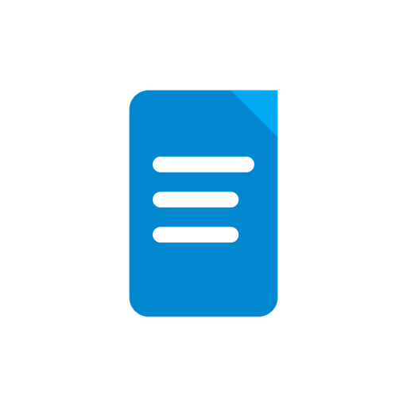
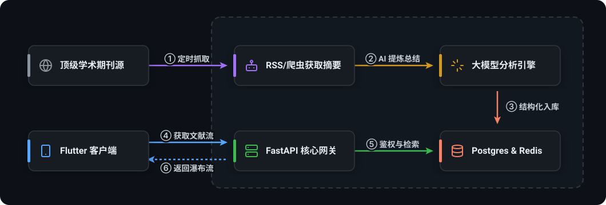
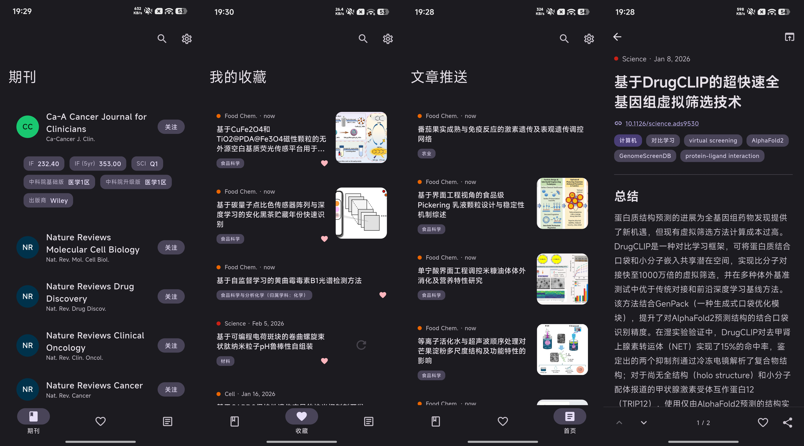

<p align="center">
  
</p>

<h1 align="center">PaperPulse</h1>

<p align="center">
  刷论文，像刷资讯一样简单
</p>

<p align="center">
  
  
  
  
  
  
  
  
</p>

PaperPulse 是一款面向科研用户的论文追踪与阅读应用。

它会把你关注期刊的新论文整理成像信息流一样的阅读体验，并优先提供结构化中文摘要，帮助你更快判断这篇文章值不值得深入阅读。

## 你可以用它做什么

- 关注自己关心的期刊
- 在首页持续查看最新论文更新
- 先读中文结构化摘要，再决定是否打开原文
- 收藏重要文章，随时回看

## 适合谁

- 想高效追踪论文更新的研究生
- 需要持续关注多个期刊的科研工作者
- 不想每天手动刷官网、RSS 和数据库的用户
- 希望先快速理解论文，再决定是否精读的人

## 核心体验

### 像刷资讯一样刷论文

不再是一次次打开期刊官网、搜索数据库、手动筛选标题。  
PaperPulse 会把关注期刊的新内容汇总到一个统一的信息流里，让"跟进论文"这件事更接近日常阅读应用的体验。

### 先看懂，再决定要不要读全文

每篇文章优先展示结构化中文摘要，包括核心内容、背景、亮点和关键信息。  
你可以先快速判断价值，再进入 DOI 或原文链接继续阅读。

### 让高频关注变得可持续

收藏、已读、本地缓存和同步机制都围绕"长期追踪"设计。  
不是只看一篇，而是帮助你长期维护自己的期刊关注清单和阅读节奏。

## 工作原理


后端定时抓取你订阅期刊的 RSS 源，自动爬取文章摘要并存储在数据库中。同时将新文章批量推送至 Qwen LLM 进行智能推理，生成结构化的中文总结。用户端则像刷信息流一样浏览经过 LLM 处理的优质内容，无需手动筛选。


## 功能亮点

- 期刊关注
- 最新论文信息流
- 中文结构化摘要
- 文章收藏

## 界面预览



## 为什么做这个项目

很多科研用户真正缺的不是“获取论文的渠道”，而是更轻量、更连续、更适合日常使用的阅读入口。

PaperPulse 想解决的是这几个常见问题：

- 期刊分散，更新难跟
- 新论文太多，难以快速判断优先级
- 阅读和收藏状态容易丢失
- 每次都要重复搜索、重复筛选

它希望把“追论文”从低效、重复的机械工作，变成更顺手、更连贯的日常体验。
### 跨学科探索，拓展视野

即使你不是某个领域的专家，PaperPulse 的 AI 摘要也能帮你理解论文的核心价值。我们将复杂的学术内容转化为结构化、易懂的中文总结，让你能够：

- 快速掌握陌生领域论文的核心思想
- 发现不同学科间的有趣联系
- 在感兴趣的范围外也能获得启发
- 通过多学科阅读拓展知识广度


## 当前项目状态

目前仓库提供的是可自行部署和运行的版本，包含：

- 后端服务
- Flutter 客户端
- 本地缓存与同步逻辑
- 期刊抓取与摘要生成流程

如果你是普通用户，可以关注后续提供现成安装包。  
如果你具备基础开发环境，也可以自行部署体验。

## 最快速体验（Docker 后端 + Release 安装包）

面向非开发者的最快体验路径：

1. 用 `docker compose` 启动后端（无需本地安装 Python）。
2. 从本项目 Release 下载前端安装包（例如 Android 的 APK），安装后在设置里填入后端地址即可使用。

### 1) 启动后端（Docker）

前置条件：已安装 Docker Desktop（或等效 Docker 环境）。

```powershell
cd backend
Copy-Item .env.example .env
docker compose up -d
```

默认会拉取 `docker-compose.yml` 中配置的后端镜像；如需覆盖镜像版本，可设置 `BACKEND_IMAGE` 环境变量。

启动后端后可用这些地址自检：

- `http://127.0.0.1:8000/`（健康检查）
- `http://127.0.0.1:8000/status`（客户端握手，返回后端标识与版本）

### 2) 安装前端（Release）

1. 到本项目的 Release 页面下载对应平台的安装包。
2. 安装并打开 App。
3. **进入 `设置 -> 网络`，填写 API Base URL。** 客户端会先验证后端状态，验证通过后才保存地址。

常见本地地址：

- Windows 本机后端：`http://127.0.0.1:8000`
- Android 模拟器访问宿主机：`http://10.0.2.2:8000`

## 想自己运行

如果你想本地部署体验：

- 后端说明见 `backend/README.md`
- 前端说明见 `frontend_app/README.md`

## 目录说明

- `backend/`: API、抓取器、摘要任务、调度服务
- `frontend_app/`: Flutter 客户端
- `assets/`: Logo、说明图和截图资源

## 说明

本项目仍在持续迭代中，功能和界面会继续优化。  

> 注意：大语言模型生成的内容可能不完全准确，请以原文为准。
