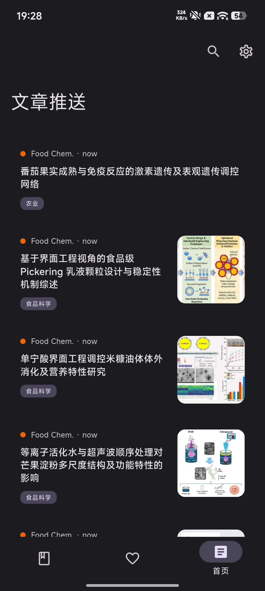
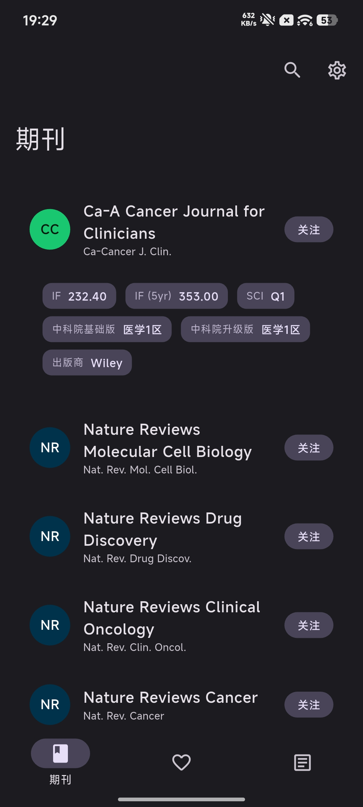
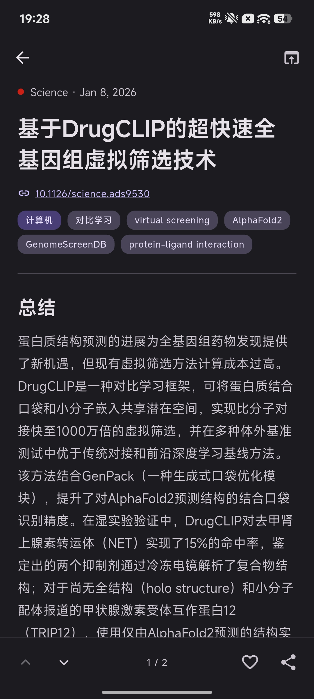
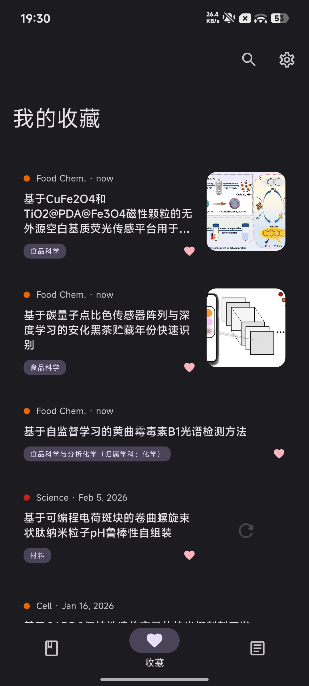

<center>

<h2>PaperPulse</h2>
</center>

> 自动追踪目标期刊最新论文总结，像刷帖子一样刷论文.


<p>
  
  
  
  
  
<a href="https://wakatime.com/badge/user/b415f305-24f8-432e-8d25-a46c15eba566/project/f7d2db16-f7c5-4782-aaf4-d651d7eb7458"></a>
</p>

## 这是什么

PaperPulse 会把你关注期刊的最新论文汇总到一个信息流中。你可以先读结构化中文总结，再决定是否精读原文，从而减少每天检索和筛选文献的时间。

## 最快开始使用

### 1) 启动后端服务

在项目根目录执行（Windows PowerShell）：

```powershell
cd backend
python -m venv .venv
.\.venv\Scripts\activate
python -m pip install -r requirements.txt
python -c "from db.database import init_database; init_database()"
fastapi dev app/main.py
```

启动成功后，可在浏览器打开 `http://127.0.0.1:8000/docs` 查看接口页面。

### 2) 配置 App 的 API 地址

在app设置-网络设置中输入正确的API地址，或直接在 `frontend_app/lib/main.dart` 中修改 `ApiClient` 的 `baseUrl`：

```dart
final apiClient = ApiClient(
  baseUrl: 'http://127.0.0.1:8000',
  ...
);
```

如果你是桌面调试或真机联调，请替换为后端的实际地址（例如 `http://127.0.0.1:8000`）。

注意：Android 默认禁用 `http` 明文请求，本地联调如果使用 `http`，需要允许 cleartext（见 `frontend_app/README.md`）。

### 3) 运行 App

```powershell
cd frontend_app
flutter pub get
flutter run
```

登录后先在“期刊”页关注期刊，再回首页下拉刷新即可看到内容流。

## 截图展示

| 首页 Feed | 期刊订阅 |
|---|---|
|||

| 文章详情 | 收藏 |
|---|---|
|||


## 常见问题

**登录后看不到内容怎么办？**  
通常是还没有订阅期刊，或当前没有新内容。先去“期刊”页关注期刊，再回首页刷新。

当期刊被首次订阅时后端会尝试抓取最新论文并交给LLM生成总结，请等待一段时间后重新刷新。

**离线时收藏和已读会丢吗？**  
不会。操作会先保存在本地，恢复网络后会自动同步。

**普通用户可以直接下载安装吗？**  
当前仓库主要以源码形式提供；如果你是开发者，可以按下方文档自行运行。

## 开发文档入口

前端说明见 `frontend_app/README.md`，后端说明见 `backend/README.md`。
## TODO

- [ ] 后端运行容器化部署
- [ ] 完善后端用户功能（密码重置等）
- [ ] 完善前端已读标记和离线功能
- [ ] 完善前端文章数据库
- [ ] 前端筛选功能
- [ ] 前端设置页用户功能完善
